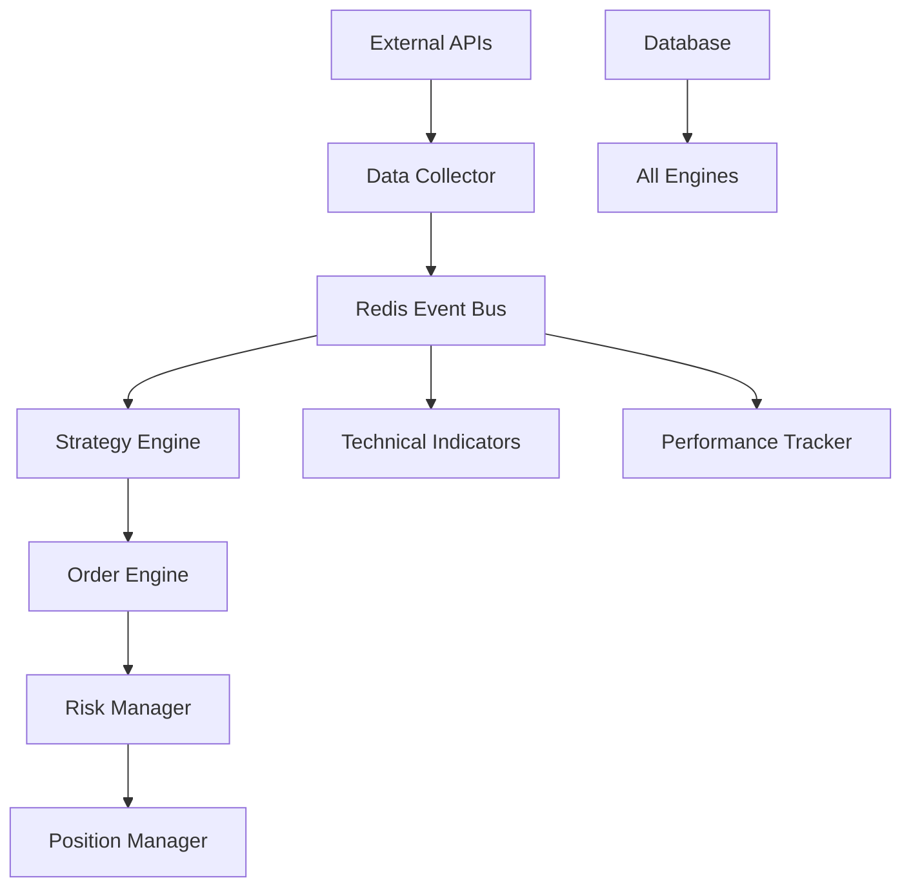

# QB Trading System 개발자 가이드

**버전**: 1.0  
**최종 업데이트**: 2025년 1월 27일  

---

## 📋 개요

QB Trading System은 모듈화된 이벤트 기반 아키텍처로 구축된 자동 거래 시스템입니다. 이 가이드는 시스템 확장, 새로운 전략 개발, 커스텀 컴포넌트 구현을 위한 개발자용 문서입니다.

### 핵심 설계 원칙
- **모듈화**: 각 컴포넌트는 독립적으로 개발/테스트 가능
- **이벤트 기반**: 느슨한 결합을 통한 확장성 확보
- **플러그인 아키텍처**: 런타임 컴포넌트 추가/제거
- **타입 안전성**: Python 타입 힌트 활용
- **테스트 우선**: 포괄적인 단위/통합 테스트

---

## 🏗️ 시스템 아키텍처

### 전체 구조
```
qb/
├── engines/           # 핵심 엔진들
│   ├── data_collector/    # 데이터 수집 엔진
│   ├── strategy_engine/   # 전략 실행 엔진
│   ├── order_engine/      # 주문 관리 엔진
│   └── risk_manager/      # 리스크 관리 엔진
├── utils/            # 유틸리티 모듈
├── database/         # 데이터베이스 관련
├── external/         # 외부 API 클라이언트
├── models/           # 데이터 모델
└── tests/            # 테스트 코드
```

### 이벤트 흐름


---

## 🔧 개발 환경 설정

### 1. 개발 환경 구성

#### 필수 도구
```bash
# Python 환경
conda create -n qb-dev python=3.11
conda activate qb-dev

# 개발 도구
pip install pytest pytest-asyncio pytest-cov
pip install black isort mypy flake8
pip install pre-commit

# 프로젝트 의존성
pip install -r requirements.txt
pip install -r requirements-dev.txt
```

#### IDE 설정 (VS Code)
```json
// .vscode/settings.json
{
    "python.defaultInterpreterPath": "/Users/dongwon/anaconda3/envs/qb-dev/bin/python",
    "python.linting.enabled": true,
    "python.linting.mypyEnabled": true,
    "python.formatting.provider": "black",
    "python.testing.pytestEnabled": true,
    "python.testing.pytestArgs": ["tests/"]
}
```

### 2. 개발 서버 시작

```bash
# Docker 서비스 시작 (Redis, PostgreSQL, TimescaleDB)
docker-compose -f docker-compose.dev.yml up -d

# 데이터베이스 마이그레이션
python -m qb.database.migrations.run

# 개발 모드로 시스템 시작
QB_ENV=development python -m qb.main
```

### 3. 코드 품질 도구

#### Pre-commit 훅 설정
```bash
# .pre-commit-config.yaml
repos:
  - repo: https://github.com/psf/black
    rev: 23.1.0
    hooks:
      - id: black
  - repo: https://github.com/pycqa/isort
    rev: 5.12.0
    hooks:
      - id: isort
  - repo: https://github.com/pre-commit/mirrors-mypy
    rev: v1.0.1
    hooks:
      - id: mypy

# 설치
pre-commit install
```

---

## 🎯 새로운 전략 개발

### 1. BaseStrategy 클래스 이해

모든 거래 전략은 `BaseStrategy`를 상속받아 구현합니다.

```python
# qb/engines/strategy_engine/base.py
from abc import ABC, abstractmethod
from typing import Dict, Any, List, Optional
from datetime import datetime

class BaseStrategy(ABC):
    """모든 거래 전략의 기본 추상 클래스"""
    
    def __init__(self, params: Optional[Dict[str, Any]] = None):
        self.params = params or {}
        self.name = self.__class__.__name__
        self.is_active = False
        
    @abstractmethod
    async def analyze(self, market_data: MarketData) -> Optional[TradingSignal]:
        """시장 데이터 분석 및 거래 신호 생성"""
        pass
    
    @abstractmethod
    def get_required_indicators(self) -> List[str]:
        """필요한 기술적 지표 목록 반환"""
        pass
    
    @abstractmethod
    def get_parameter_schema(self) -> Dict[str, Dict[str, Any]]:
        """파라미터 스키마 정보 반환"""
        pass
    
    def get_description(self) -> str:
        """전략 설명 반환"""
        return f"{self.name} 전략"
```

### 2. 전략 구현 예제

#### RSI 기반 전략
```python
# qb/engines/strategy_engine/strategies/rsi_strategy.py
from typing import Dict, Any, List, Optional
from datetime import datetime

from ..base import BaseStrategy, MarketData, TradingSignal

class RSIStrategy(BaseStrategy):
    """RSI 기반 거래 전략"""
    
    def __init__(self, params: Optional[Dict[str, Any]] = None):
        default_params = {
            "rsi_period": 14,           # RSI 계산 기간
            "oversold_threshold": 30,   # 과매도 임계값
            "overbought_threshold": 70, # 과매수 임계값
            "min_confidence": 0.6       # 최소 신뢰도
        }
        super().__init__(params or default_params)
        self.positions = {}  # 포지션 추적
    
    async def analyze(self, market_data: MarketData) -> Optional[TradingSignal]:
        """RSI 분석 및 신호 생성"""
        try:
            symbol = market_data.symbol
            price = market_data.close
            indicators = market_data.indicators or {}
            
            # RSI 값 확인
            rsi = indicators.get(f"rsi_{self.params['rsi_period']}")
            if rsi is None:
                return None
            
            has_position = symbol in self.positions
            
            # 매수 신호: RSI < 30 (과매도)
            if rsi < self.params['oversold_threshold'] and not has_position:
                confidence = self._calculate_buy_confidence(rsi, price, indicators)
                if confidence >= self.params['min_confidence']:
                    self.positions[symbol] = {
                        'entry_price': price,
                        'entry_time': market_data.timestamp,
                        'entry_rsi': rsi
                    }
                    return self._create_buy_signal(symbol, price, rsi, confidence, market_data.timestamp)
            
            # 매도 신호: RSI > 70 (과매수)
            elif rsi > self.params['overbought_threshold'] and has_position:
                confidence = self._calculate_sell_confidence(rsi, price, indicators)
                if confidence >= self.params['min_confidence']:
                    del self.positions[symbol]
                    return self._create_sell_signal(symbol, price, rsi, confidence, market_data.timestamp)
            
            return None
            
        except Exception as e:
            logger.error(f"RSI 전략 분석 오류: {e}")
            return None
    
    def _calculate_buy_confidence(self, rsi: float, price: float, indicators: Dict) -> float:
        """매수 신뢰도 계산"""
        # RSI가 낮을수록 높은 신뢰도
        base_confidence = (30 - rsi) / 30 * 0.8 + 0.2
        
        # 볼륨 확인
        volume_ratio = indicators.get('volume_ratio', 1.0)
        if volume_ratio > 1.5:  # 평균 볼륨의 1.5배 이상
            base_confidence *= 1.1
        
        return min(0.95, base_confidence)
    
    def _calculate_sell_confidence(self, rsi: float, price: float, indicators: Dict) -> float:
        """매도 신뢰도 계산"""
        # RSI가 높을수록 높은 신뢰도
        base_confidence = (rsi - 70) / 30 * 0.8 + 0.2
        
        # 수익률 확인
        symbol = next(iter(self.positions.keys()))
        entry_price = self.positions[symbol]['entry_price']
        return_rate = (price - entry_price) / entry_price
        
        if return_rate > 0.02:  # 2% 이상 수익
            base_confidence *= 1.1
        
        return min(0.95, base_confidence)
    
    def _create_buy_signal(self, symbol: str, price: float, rsi: float, 
                          confidence: float, timestamp: datetime) -> TradingSignal:
        """매수 신호 생성"""
        return TradingSignal(
            action='BUY',
            symbol=symbol,
            confidence=confidence,
            price=price,
            reason=f"RSI 과매도 신호 (RSI: {rsi:.1f})",
            metadata={
                'strategy': 'RSI',
                'rsi': rsi,
                'threshold': self.params['oversold_threshold']
            },
            timestamp=timestamp
        )
    
    def _create_sell_signal(self, symbol: str, price: float, rsi: float,
                           confidence: float, timestamp: datetime) -> TradingSignal:
        """매도 신호 생성"""
        return TradingSignal(
            action='SELL',
            symbol=symbol,
            confidence=confidence,
            price=price,
            reason=f"RSI 과매수 신호 (RSI: {rsi:.1f})",
            metadata={
                'strategy': 'RSI',
                'rsi': rsi,
                'threshold': self.params['overbought_threshold']
            },
            timestamp=timestamp
        )
    
    def get_required_indicators(self) -> List[str]:
        """필요한 지표 목록"""
        return [
            f"rsi_{self.params['rsi_period']}",
            "volume_ratio"
        ]
    
    def get_parameter_schema(self) -> Dict[str, Dict[str, Any]]:
        """파라미터 스키마"""
        return {
            'rsi_period': {
                'type': int,
                'default': 14,
                'min': 5,
                'max': 50,
                'description': 'RSI 계산 기간'
            },
            'oversold_threshold': {
                'type': float,
                'default': 30,
                'min': 10,
                'max': 40,
                'description': '과매도 임계값'
            },
            'overbought_threshold': {
                'type': float,
                'default': 70,
                'min': 60,
                'max': 90,
                'description': '과매수 임계값'
            }
        }
    
    def get_description(self) -> str:
        """전략 설명"""
        return f"RSI {self.params['rsi_period']}일 기반 역추세 전략"
```

### 3. 전략 테스트 작성

```python
# tests/test_rsi_strategy.py
import pytest
from datetime import datetime
from qb.engines.strategy_engine.strategies.rsi_strategy import RSIStrategy
from qb.engines.strategy_engine.base import MarketData

class TestRSIStrategy:
    
    @pytest.fixture
    def strategy(self):
        return RSIStrategy()
    
    @pytest.mark.asyncio
    async def test_buy_signal_generation(self, strategy):
        """매수 신호 생성 테스트"""
        market_data = MarketData(
            symbol="005930",
            timestamp=datetime.now(),
            open=75000, high=75500, low=74500, close=75000,
            volume=1000000,
            interval_type="1m",
            indicators={
                "rsi_14": 25.0,  # 과매도 상태
                "volume_ratio": 1.8
            }
        )
        
        signal = await strategy.analyze(market_data)
        
        assert signal is not None
        assert signal.action == 'BUY'
        assert signal.confidence > 0.6
        assert "과매도" in signal.reason
    
    @pytest.mark.asyncio
    async def test_sell_signal_generation(self, strategy):
        """매도 신호 생성 테스트"""
        # 먼저 포지션 설정
        strategy.positions["005930"] = {
            'entry_price': 74000,
            'entry_time': datetime.now(),
            'entry_rsi': 25.0
        }
        
        market_data = MarketData(
            symbol="005930",
            timestamp=datetime.now(),
            open=75000, high=76000, low=75000, close=75500,
            volume=800000,
            interval_type="1m",
            indicators={
                "rsi_14": 75.0,  # 과매수 상태
                "volume_ratio": 1.2
            }
        )
        
        signal = await strategy.analyze(market_data)
        
        assert signal is not None
        assert signal.action == 'SELL'
        assert signal.confidence > 0.6
        assert "과매수" in signal.reason
```

---

## 🔌 플러그인 시스템 확장

### 1. 새로운 기술적 지표 추가

```python
# qb/indicators/custom_indicators.py
import numpy as np
import pandas as pd
from typing import List, Optional

class CustomIndicators:
    """커스텀 기술적 지표 집합"""
    
    @staticmethod
    def stochastic_rsi(rsi_series: pd.Series, period: int = 14) -> pd.Series:
        """Stochastic RSI 계산"""
        min_rsi = rsi_series.rolling(window=period).min()
        max_rsi = rsi_series.rolling(window=period).max()
        
        stoch_rsi = (rsi_series - min_rsi) / (max_rsi - min_rsi) * 100
        return stoch_rsi
    
    @staticmethod
    def williams_r(high: pd.Series, low: pd.Series, close: pd.Series, 
                   period: int = 14) -> pd.Series:
        """Williams %R 계산"""
        highest_high = high.rolling(window=period).max()
        lowest_low = low.rolling(window=period).min()
        
        williams_r = (highest_high - close) / (highest_high - lowest_low) * -100
        return williams_r
    
    @staticmethod
    def commodity_channel_index(high: pd.Series, low: pd.Series, 
                               close: pd.Series, period: int = 20) -> pd.Series:
        """Commodity Channel Index 계산"""
        typical_price = (high + low + close) / 3
        sma_tp = typical_price.rolling(window=period).mean()
        mad = typical_price.rolling(window=period).apply(
            lambda x: np.mean(np.abs(x - x.mean()))
        )
        
        cci = (typical_price - sma_tp) / (0.015 * mad)
        return cci
```

### 2. 새로운 데이터 소스 추가

```python
# qb/external/binance_client.py
import asyncio
import websockets
import json
from typing import Dict, Any, Callable

class BinanceWebSocketClient:
    """바이낸스 WebSocket 클라이언트"""
    
    def __init__(self):
        self.ws_url = "wss://stream.binance.com:9443/ws/"
        self.subscriptions = set()
        self.callbacks = {}
    
    async def subscribe_kline(self, symbol: str, interval: str, 
                             callback: Callable[[Dict], None]):
        """캔들스틱 데이터 구독"""
        stream = f"{symbol.lower()}@kline_{interval}"
        self.subscriptions.add(stream)
        self.callbacks[stream] = callback
        
        await self._connect()
    
    async def _connect(self):
        """WebSocket 연결"""
        streams = "/".join(self.subscriptions)
        uri = f"{self.ws_url}{streams}"
        
        async with websockets.connect(uri) as websocket:
            async for message in websocket:
                data = json.loads(message)
                stream = data.get('stream')
                
                if stream in self.callbacks:
                    await self.callbacks[stream](data['data'])
```

---

## 📊 데이터베이스 확장

### 1. 새로운 모델 추가

```python
# qb/models/portfolio.py
from sqlalchemy import Column, Integer, String, Float, DateTime, Boolean
from sqlalchemy.ext.declarative import declarative_base
from datetime import datetime

Base = declarative_base()

class Portfolio(Base):
    """포트폴리오 모델"""
    __tablename__ = 'portfolios'
    
    id = Column(Integer, primary_key=True)
    name = Column(String(100), nullable=False)
    description = Column(String(500))
    created_at = Column(DateTime, default=datetime.utcnow)
    is_active = Column(Boolean, default=True)
    
    # 성과 지표
    total_value = Column(Float, default=0.0)
    total_return = Column(Float, default=0.0)
    max_drawdown = Column(Float, default=0.0)
    sharpe_ratio = Column(Float, default=0.0)

class PortfolioPosition(Base):
    """포트폴리오 포지션 모델"""
    __tablename__ = 'portfolio_positions'
    
    id = Column(Integer, primary_key=True)
    portfolio_id = Column(Integer, nullable=False)
    symbol = Column(String(20), nullable=False)
    quantity = Column(Integer, default=0)
    avg_price = Column(Float, default=0.0)
    current_price = Column(Float, default=0.0)
    unrealized_pnl = Column(Float, default=0.0)
    updated_at = Column(DateTime, default=datetime.utcnow)
```

### 2. 마이그레이션 스크립트

```python
# qb/database/migrations/add_portfolio_tables.py
from alembic import op
import sqlalchemy as sa
from datetime import datetime

def upgrade():
    """포트폴리오 테이블 추가"""
    op.create_table(
        'portfolios',
        sa.Column('id', sa.Integer, primary_key=True),
        sa.Column('name', sa.String(100), nullable=False),
        sa.Column('description', sa.String(500)),
        sa.Column('created_at', sa.DateTime, default=datetime.utcnow),
        sa.Column('is_active', sa.Boolean, default=True),
        sa.Column('total_value', sa.Float, default=0.0),
        sa.Column('total_return', sa.Float, default=0.0),
        sa.Column('max_drawdown', sa.Float, default=0.0),
        sa.Column('sharpe_ratio', sa.Float, default=0.0)
    )
    
    op.create_table(
        'portfolio_positions',
        sa.Column('id', sa.Integer, primary_key=True),
        sa.Column('portfolio_id', sa.Integer, nullable=False),
        sa.Column('symbol', sa.String(20), nullable=False),
        sa.Column('quantity', sa.Integer, default=0),
        sa.Column('avg_price', sa.Float, default=0.0),
        sa.Column('current_price', sa.Float, default=0.0),
        sa.Column('unrealized_pnl', sa.Float, default=0.0),
        sa.Column('updated_at', sa.DateTime, default=datetime.utcnow)
    )

def downgrade():
    """포트폴리오 테이블 제거"""
    op.drop_table('portfolio_positions')
    op.drop_table('portfolios')
```

---

## 🧪 테스팅 전략

### 1. 단위 테스트

```python
# tests/engines/test_strategy_engine.py
import pytest
from unittest.mock import AsyncMock, MagicMock
from qb.engines.strategy_engine.engine import StrategyEngine

class TestStrategyEngine:
    
    @pytest.fixture
    def mock_redis(self):
        return AsyncMock()
    
    @pytest.fixture
    def mock_event_bus(self):
        return AsyncMock()
    
    @pytest.fixture
    def strategy_engine(self, mock_redis, mock_event_bus):
        return StrategyEngine(mock_redis, mock_event_bus)
    
    @pytest.mark.asyncio
    async def test_activate_strategy(self, strategy_engine):
        """전략 활성화 테스트"""
        success = await strategy_engine.activate_strategy(
            "TestStrategy", 
            {"param1": "value1"}, 
            ["AAPL", "GOOGL"]
        )
        assert success
        assert "TestStrategy" in strategy_engine.active_strategies
    
    @pytest.mark.asyncio
    async def test_deactivate_strategy(self, strategy_engine):
        """전략 비활성화 테스트"""
        # 먼저 활성화
        await strategy_engine.activate_strategy("TestStrategy", {}, ["AAPL"])
        
        # 비활성화
        success = await strategy_engine.deactivate_strategy("TestStrategy")
        assert success
        assert "TestStrategy" not in strategy_engine.active_strategies
```

### 2. 통합 테스트

```python
# tests/integration/test_full_workflow.py
import pytest
import asyncio
from qb.engines.data_collector import DataCollector
from qb.engines.strategy_engine import StrategyEngine
from qb.engines.order_engine import OrderEngine

@pytest.mark.integration
class TestFullWorkflow:
    
    @pytest.mark.asyncio
    async def test_data_to_signal_workflow(self):
        """데이터 → 신호 전체 워크플로우 테스트"""
        # 컴포넌트 초기화
        data_collector = DataCollector()
        strategy_engine = StrategyEngine()
        order_engine = OrderEngine()
        
        # 시스템 시작
        await data_collector.start()
        await strategy_engine.start()
        await order_engine.start()
        
        # 전략 활성화
        await strategy_engine.activate_strategy(
            "MovingAverage1M5MStrategy",
            {"ma_period": 5},
            ["005930"]
        )
        
        # 시장 데이터 시뮬레이션
        market_data = {
            "symbol": "005930",
            "close": 75200,
            "timestamp": "2025-01-27T09:30:00"
        }
        
        # 이벤트 발행
        await data_collector.publish_market_data(market_data)
        
        # 신호 생성 대기
        await asyncio.sleep(1)
        
        # 결과 검증
        signals = await order_engine.get_pending_signals()
        assert len(signals) > 0
```

### 3. 성능 테스트

```python
# tests/performance/test_strategy_performance.py
import pytest
import asyncio
import time
from qb.engines.strategy_engine import StrategyEngine

@pytest.mark.performance
class TestStrategyPerformance:
    
    @pytest.mark.asyncio
    async def test_strategy_latency(self):
        """전략 실행 지연시간 테스트"""
        strategy_engine = StrategyEngine()
        await strategy_engine.start()
        
        # 대량 데이터 준비
        market_data_list = [
            {"symbol": f"00{i:04d}", "close": 1000 + i, "timestamp": time.time()}
            for i in range(1000)
        ]
        
        # 실행 시간 측정
        start_time = time.time()
        
        for data in market_data_list:
            await strategy_engine.process_market_data(data)
        
        end_time = time.time()
        latency = (end_time - start_time) / len(market_data_list) * 1000  # ms
        
        # 1ms 이하여야 함
        assert latency < 1.0
        print(f"Average latency: {latency:.2f}ms")
```

---

## 📈 모니터링 및 로깅

### 1. 로깅 설정

```python
# qb/utils/logging_config.py
import logging
import logging.handlers
from pathlib import Path

def setup_logging(log_level: str = "INFO"):
    """로깅 설정"""
    log_dir = Path("logs")
    log_dir.mkdir(exist_ok=True)
    
    # 루트 로거 설정
    root_logger = logging.getLogger()
    root_logger.setLevel(getattr(logging, log_level.upper()))
    
    # 콘솔 핸들러
    console_handler = logging.StreamHandler()
    console_handler.setLevel(logging.INFO)
    console_format = logging.Formatter(
        '%(asctime)s - %(name)s - %(levelname)s - %(message)s'
    )
    console_handler.setFormatter(console_format)
    
    # 파일 핸들러 (로테이팅)
    file_handler = logging.handlers.RotatingFileHandler(
        log_dir / "qb_trading.log",
        maxBytes=10*1024*1024,  # 10MB
        backupCount=10
    )
    file_handler.setLevel(logging.DEBUG)
    file_format = logging.Formatter(
        '%(asctime)s - %(name)s - %(levelname)s - %(funcName)s:%(lineno)d - %(message)s'
    )
    file_handler.setFormatter(file_format)
    
    # 핸들러 추가
    root_logger.addHandler(console_handler)
    root_logger.addHandler(file_handler)
    
    # 특정 로거 레벨 조정
    logging.getLogger('urllib3').setLevel(logging.WARNING)
    logging.getLogger('requests').setLevel(logging.WARNING)
```

### 2. 메트릭 수집

```python
# qb/utils/metrics.py
import time
from typing import Dict, Any
from collections import defaultdict
import threading

class MetricsCollector:
    """메트릭 수집기"""
    
    def __init__(self):
        self.counters = defaultdict(int)
        self.gauges = {}
        self.histograms = defaultdict(list)
        self.lock = threading.Lock()
    
    def increment_counter(self, name: str, value: int = 1):
        """카운터 증가"""
        with self.lock:
            self.counters[name] += value
    
    def set_gauge(self, name: str, value: float):
        """게이지 값 설정"""
        with self.lock:
            self.gauges[name] = value
    
    def record_histogram(self, name: str, value: float):
        """히스토그램 값 기록"""
        with self.lock:
            self.histograms[name].append(value)
            
            # 최근 1000개만 유지
            if len(self.histograms[name]) > 1000:
                self.histograms[name] = self.histograms[name][-1000:]
    
    def get_metrics(self) -> Dict[str, Any]:
        """모든 메트릭 조회"""
        with self.lock:
            return {
                'counters': dict(self.counters),
                'gauges': dict(self.gauges),
                'histograms': {
                    name: {
                        'count': len(values),
                        'mean': sum(values) / len(values) if values else 0,
                        'min': min(values) if values else 0,
                        'max': max(values) if values else 0
                    }
                    for name, values in self.histograms.items()
                }
            }

# 전역 메트릭 수집기
metrics = MetricsCollector()

# 데코레이터
def measure_time(metric_name: str):
    """실행 시간 측정 데코레이터"""
    def decorator(func):
        async def async_wrapper(*args, **kwargs):
            start_time = time.time()
            try:
                result = await func(*args, **kwargs)
                return result
            finally:
                duration = time.time() - start_time
                metrics.record_histogram(metric_name, duration * 1000)  # ms
        
        def sync_wrapper(*args, **kwargs):
            start_time = time.time()
            try:
                result = func(*args, **kwargs)
                return result
            finally:
                duration = time.time() - start_time
                metrics.record_histogram(metric_name, duration * 1000)  # ms
        
        return async_wrapper if asyncio.iscoroutinefunction(func) else sync_wrapper
    return decorator
```

---

## 🚀 배포 및 운영

### 1. Docker 컨테이너화

```dockerfile
# Dockerfile
FROM python:3.11-slim

WORKDIR /app

# 시스템 패키지 설치
RUN apt-get update && apt-get install -y \
    gcc \
    g++ \
    && rm -rf /var/lib/apt/lists/*

# Python 의존성 설치
COPY requirements.txt .
RUN pip install --no-cache-dir -r requirements.txt

# 애플리케이션 코드 복사
COPY qb/ ./qb/
COPY main.py .

# 환경 변수
ENV PYTHONPATH=/app
ENV QB_ENV=production

# 포트 노출
EXPOSE 8080

# 헬스체크
HEALTHCHECK --interval=30s --timeout=10s --start-period=5s --retries=3 \
    CMD python -c "import requests; requests.get('http://localhost:8080/health')"

# 시작 명령
CMD ["python", "-m", "qb.main"]
```

### 2. Kubernetes 배포

```yaml
# k8s/deployment.yaml
apiVersion: apps/v1
kind: Deployment
metadata:
  name: qb-trading-system
spec:
  replicas: 1
  selector:
    matchLabels:
      app: qb-trading
  template:
    metadata:
      labels:
        app: qb-trading
    spec:
      containers:
      - name: qb-trading
        image: qb-trading:latest
        ports:
        - containerPort: 8080
        env:
        - name: QB_ENV
          value: "production"
        - name: KIS_APPKEY
          valueFrom:
            secretKeyRef:
              name: kis-secrets
              key: appkey
        - name: KIS_APPSECRET
          valueFrom:
            secretKeyRef:
              name: kis-secrets
              key: appsecret
        resources:
          requests:
            memory: "2Gi"
            cpu: "1000m"
          limits:
            memory: "4Gi"
            cpu: "2000m"
        livenessProbe:
          httpGet:
            path: /health
            port: 8080
          initialDelaySeconds: 30
          periodSeconds: 30
        readinessProbe:
          httpGet:
            path: /ready
            port: 8080
          initialDelaySeconds: 5
          periodSeconds: 5
```

### 3. 모니터링 설정

```yaml
# prometheus/rules.yaml
groups:
  - name: qb-trading-alerts
    rules:
    - alert: HighErrorRate
      expr: rate(qb_errors_total[5m]) > 0.1
      for: 2m
      labels:
        severity: warning
      annotations:
        summary: "High error rate detected"
        description: "Error rate is {{ $value }} errors per second"
    
    - alert: StrategyDown
      expr: qb_active_strategies == 0
      for: 1m
      labels:
        severity: critical
      annotations:
        summary: "No active strategies"
        description: "All trading strategies are inactive"
```

---

## 📚 참고 자료

### API 문서
- **Strategy Engine**: `/docs/api/strategy-engine.md`
- **Order Engine**: `/docs/api/order-engine.md`
- **Data Collector**: `/docs/api/data-collector.md`

### 예제 코드
- **전략 예제**: `/examples/strategies/`
- **백테스팅 예제**: `/examples/backtesting/`
- **커스텀 지표**: `/examples/indicators/`

### 외부 문서
- [KIS Open Trading API](https://apiportal.koreainvestment.com/)
- [TA-Lib Documentation](https://ta-lib.org/function.html)
- [Redis Event Streams](https://redis.io/docs/data-types/streams/)

---

## 🤝 기여 가이드

### 1. 코드 기여 절차

1. **Issue 생성**: 새로운 기능이나 버그 리포트
2. **Fork & Branch**: 개인 저장소에서 feature 브랜치 생성
3. **개발**: 코드 작성 및 테스트
4. **PR 생성**: 상세한 설명과 함께 Pull Request
5. **코드 리뷰**: 팀 리뷰 및 피드백 반영
6. **병합**: 승인 후 main 브랜치에 병합

### 2. 코딩 컨벤션

```python
# 좋은 예
class StrategyEngine:
    """전략 엔진 클래스
    
    Args:
        redis: Redis 관리자 인스턴스
        event_bus: 이벤트 버스 인스턴스
    """
    
    def __init__(self, redis: RedisManager, event_bus: EventBus) -> None:
        self._redis = redis
        self._event_bus = event_bus
        self._active_strategies: Dict[str, BaseStrategy] = {}
    
    async def activate_strategy(
        self, 
        strategy_name: str, 
        params: Optional[Dict[str, Any]] = None,
        symbols: Optional[List[str]] = None
    ) -> bool:
        """전략 활성화
        
        Args:
            strategy_name: 전략 이름
            params: 전략 파라미터
            symbols: 대상 종목 리스트
            
        Returns:
            성공 여부
        """
        try:
            # 구현 내용
            return True
        except Exception as e:
            logger.error(f"전략 활성화 실패: {e}")
            return False
```

### 3. 문서 작성 가이드

- **코드 문서**: 모든 클래스/메서드에 docstring 작성
- **README**: 각 모듈별 README.md 파일 유지
- **CHANGELOG**: 버전별 변경사항 기록
- **API 문서**: OpenAPI 스펙으로 REST API 문서화

---

**📞 개발 문의**: qb-dev-team@example.com  
**🐛 버그 리포트**: https://github.com/your-repo/QB/issues  
**💡 기능 제안**: https://github.com/your-repo/QB/discussions  

---

*QB Trading System Development Team*  
*Version 1.0 - 2025.01.27*